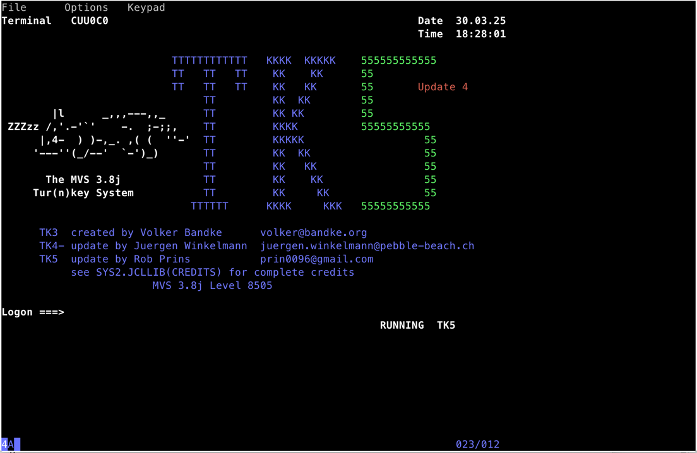

# Hercules under Docker

This project is mainly a Dockerfile that pulls, builds and runs the hercules 
IBM Host emulator. The Dockerfile installs by default the TK5 MVS on which 
the emulator is started. 

## Quickstart

The easiest way to start a HOST on your AMD64 PC is to build and start it 
via Docker. This will create the image and starts it in a docker container. The 
container will then install TK5 if nothing is mounted under /opt/hercules.

### To run a fresh TK5 environment
```bash
# build the docker image
docker build --tag=hercules-hyperion .
# start hercules as a docker container
./hcStart
# connect with a 3270 terminal to the HOST
c3270 localhost:3270
```
__Attention:__ When you are using this method, all your work is gone when 
you delete the container. So this is for tests only.



### Running on a pre installed MVS/OS390/ZOS environment
If you have a preinstalled MVS, OS390, ZOS or any other hercules 
environment you can mount it to the containers directory ```/opt/hercules```.

This also makes your TK5 environment persistent over multiple launches of 
the image. If the folder is empty, the container will install TK5. If it 
finds a not empty directory it will start that environment.

To do so call the ```hcStart``` command with tro 
parameters:

```bash
./hcStart /path/to/hercules-environment:/opt/hercules myname
```

This will start hercules on the preinstalled environment and names the 
container hercules-myname

## Ports
The following ports should be published:

* 3270 to connect a 3270 terminal
* 3278 to ??
* 8038 for a (eventually) configured web frontend

## Volumes
The container can take a hercules environment under the path 
```/opt/hercules```. The mounted directory should contain all files 
necessary for hercules to run a HOST environment.

### Requirements

The start script assumes that the initial program load script is in the 
```scripts/ipl.rc``` file of you mounted environment.

The configuration has to be stored in the ```conf/hercules.cnf``` file.

```log
/my/hercules-host-env
  .
  +--conf/hercules.cnf
  +--scripts/ipl.rc
  +--<A lot of other stuff>
```
